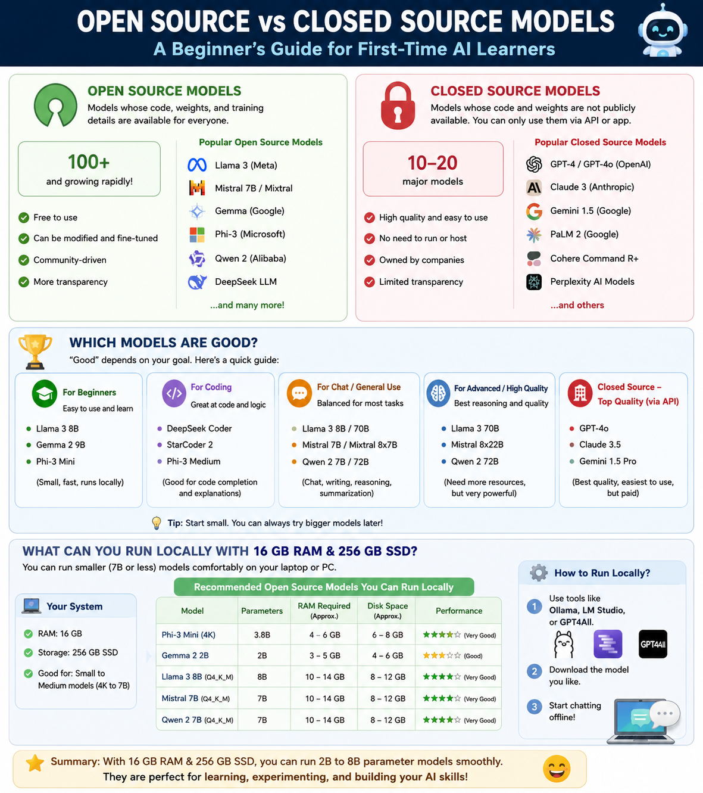

# LLM Basics — Open Source vs Closed Source Models

> Last updated: May 2026

---

## What is an LLM?

A **Large Language Model (LLM)** is an AI model trained on massive text datasets to understand and generate human-like text. They power chatbots, code assistants, search engines, and more.

---

## Infographic Overview



---

## Open Source vs Closed Source — Quick Visual

```
╔══════════════════════════════════════════════════════════════════════════════╗
║                    LLM ECOSYSTEM LANDSCAPE (2026)                          ║
╠══════════════════════════════╦═════════════════════════════════════════════╣
║      OPEN SOURCE / OPEN      ║           CLOSED SOURCE / PROPRIETARY       ║
║          WEIGHTS             ║                                              ║
╠══════════════════════════════╬═════════════════════════════════════════════╣
║  ✅ Free to download         ║  ❌ Paid API access only                    ║
║  ✅ Run locally              ║  ❌ Cannot run locally (most)               ║
║  ✅ Customizable / Fine-tune ║  ❌ Black box — no access to weights        ║
║  ✅ Privacy-friendly         ║  ✅ Managed infra — no setup needed         ║
║  ✅ No per-token cost        ║  ✅ Highest benchmark performance           ║
║  ⚠️  Needs hardware          ║  ✅ Regular updates & support               ║
╚══════════════════════════════╩═════════════════════════════════════════════╝
```

---

## Q1. How Many Open Source Models Are There?

The open-source LLM landscape is **enormous and growing rapidly**. As of 2026:

- **Hugging Face** hosts **700,000+ models** (including fine-tunes, adapters, and base models)
- **Major distinct base families**: 70+ well-known open-source/open-weight LLMs
- **Commercial-use ready models**: 50+ documented models (see github.com/eugeneyan/open-llms)

> Note: "Open source" is used loosely — many are **open-weight** (downloadable weights) but may have restrictive licenses. True OSI-certified open-source LLMs are fewer.

### Major Open Source Model Families (2026)

```
┌─────────────────────────────────────────────────────────────────────────────┐
│                    OPEN SOURCE LLM FAMILIES (2026)                         │
├──────────────────────┬──────────────────┬──────────────────────────────────┤
│  FAMILY              │  CREATOR         │  KEY MODELS                      │
├──────────────────────┼──────────────────┼──────────────────────────────────┤
│  Llama               │  Meta            │  Llama 3.3 (8B, 70B, 405B)       │
│  Qwen                │  Alibaba         │  Qwen 3.5 (7B → 397B)            │
│  Gemma               │  Google          │  Gemma 4 (9B, 26B MoE)           │
│  Mistral             │  Mistral AI      │  Mistral Small 3 (7B, 24B)       │
│  DeepSeek            │  DeepSeek        │  V3.2 (685B), R1, Coder          │
│  GLM                 │  Tsinghua / Zhipu│  GLM-5 (744B)                    │
│  Kimi                │  Moonshot AI     │  Kimi K2.5 (1T MoE)              │
│  MiniMax             │  MiniMax         │  M2.5 (230B)                     │
│  Phi                 │  Microsoft       │  Phi-4, Phi-4 Mini               │
│  Falcon              │  TII UAE         │  Falcon 2 (11B, 180B)            │
│  OLMo                │  Allen Institute │  OLMo 2 (7B, 13B)               │
│  Command R           │  Cohere          │  Command R, Command R+           │
│  Yi                  │  01.AI           │  Yi-1.5 (6B, 34B)               │
│  InternLM            │  Shanghai AI Lab │  InternLM 3 (8B, 20B)           │
│  BLOOM               │  BigScience      │  BLOOM (176B)                    │
│  MPT                 │  MosaicML        │  MPT-7B, MPT-30B                 │
│  Stable LM           │  Stability AI    │  Stable LM 2, StableLM Zephyr   │
│  StarCoder           │  BigCode         │  StarCoder 2 (3B, 7B, 15B)      │
│  WizardLM            │  Microsoft       │  WizardLM 2                      │
│  Orca                │  Microsoft       │  Orca 2, Orca Mini               │
└──────────────────────┴──────────────────┴──────────────────────────────────┘
```

**Count estimate: 20+ major families → 70+ flagship models → 700,000+ variants on Hugging Face**

---

## Q2. How Many Closed Source Models Are There?

Closed-source models are fewer but often lead on benchmark performance. Major ones as of 2026:

```
┌─────────────────────────────────────────────────────────────────────────────┐
│                   CLOSED SOURCE / PROPRIETARY LLMs (2026)                  │
├──────────────────┬─────────────────┬──────────────────────────────────────┤
│  MODEL           │  COMPANY        │  NOTES                               │
├──────────────────┼─────────────────┼──────────────────────────────────────┤
│  GPT-5.2 / GPT-4o│  OpenAI         │  400K context, 100% AIME 2025        │
│  GPT-4.1 / Nano  │  OpenAI         │  Cost-optimized, $0.10/M tokens      │
│  o1 / o3 / o4    │  OpenAI         │  Reasoning-focused series            │
│  Claude Opus 4.6 │  Anthropic      │  Top coding & reasoning              │
│  Claude Sonnet   │  Anthropic      │  Balanced performance / cost         │
│  Claude Haiku    │  Anthropic      │  Fast & lightweight                  │
│  Gemini Ultra    │  Google         │  Multimodal flagship                 │
│  Gemini Pro/Flash│  Google         │  Mid-tier, fast inference            │
│  Grok 3          │  xAI            │  Real-time X/Twitter integration     │
│  Command A       │  Cohere         │  256K context, enterprise focused    │
│  Titan / Nova    │  Amazon (AWS)   │  Bedrock-hosted enterprise models    │
│  Ernie Bot       │  Baidu          │  Chinese-language focused            │
│  Tongyi Qianwen  │  Alibaba Cloud  │  Commercial version of Qwen          │
│  Doubao          │  ByteDance      │  Consumer chat, Chinese market       │
└──────────────────┴─────────────────┴──────────────────────────────────────┘
```

**Count estimate: ~15–20 major proprietary model families**

### Visual Comparison: Volume

```
Open Source Models  ████████████████████████████████████████████  700,000+ variants
                    (70+ flagship models, 20+ families)

Closed Source       ████                                           ~15–20 families
```

---

## Q3. Which Models Are Good?

### Overall Rankings (2026)

```
╔══════════════════════════════════════════════════════════════════════════════╗
║               BEST LLMs BY CATEGORY (2026)                                 ║
╠══════════════╦═══════════════════════════════════════════════════════════════╣
║  RANK        ║  MODEL              TYPE         STRENGTH                   ║
╠══════════════╬═══════════════════════════════════════════════════════════════╣
║  🥇 1st      ║  GPT-5.2            Closed       Best overall reasoning      ║
║  🥈 2nd      ║  Claude Opus 4.6    Closed       Agentic coding, long ctx    ║
║  🥉 3rd      ║  Qwen 3.5 (397B)   Open         Best open-source overall    ║
║  4th         ║  Kimi K2.6 (1T)    Open         Top open-source coding      ║
║  5th         ║  GLM-5 (744B)      Open         SWE-bench coding leader     ║
║  6th         ║  DeepSeek V3.2     Open         Cost-efficient reasoning    ║
║  7th         ║  Gemini Ultra 2    Closed       Best multimodal             ║
║  8th         ║  Gemma 4 26B MoE   Open         Best local/consumer model   ║
╚══════════════╩═══════════════════════════════════════════════════════════════╝
```

### By Use Case

```
┌─────────────────────────────────────────────────────────────────────────────┐
│  USE CASE              │  BEST OPEN SOURCE         │  BEST CLOSED SOURCE   │
├────────────────────────┼───────────────────────────┼───────────────────────┤
│  General Chat          │  Llama 3.3 70B            │  GPT-5.2 / Claude     │
│  Coding                │  Qwen 2.5 Coder 14B       │  Claude Opus 4.6      │
│  Reasoning / Math      │  DeepSeek R1, Qwen 3.5    │  GPT o4               │
│  Multimodal (Vision)   │  Gemma 4, LLaVA           │  Gemini Ultra         │
│  Local / Edge          │  Gemma 4 2B, Phi-4 Mini   │  N/A                  │
│  Agents / Long context │  Kimi K2.6, DeepSeek V3.2 │  Claude Opus 4.6      │
│  Enterprise RAG        │  Command R+ (Cohere)      │  Command A (Cohere)   │
│  Low-resource (4GB)    │  Phi-4 Mini, Gemma 4 2B   │  N/A                  │
└────────────────────────┴───────────────────────────┴───────────────────────┘
```

### Performance Gap in 2026

```
BENCHMARK GAP (Open Source vs Closed Source)

2022  ━━━━━━━━━━━━━━━━━━━━━━━━━━━━━━░░░░░░░░░░░░░░░░  Large gap
2023  ━━━━━━━━━━━━━━━━━━━━━━━━━━━░░░░░░░░░░░░░░░░░░░  Significant gap
2024  ━━━━━━━━━━━━━━━━━━━━━━━━━░░░░░░░░░░░░░░░░░░░░░  Narrowing
2025  ━━━━━━━━━━━━━━━━━━━━━━━━░░░░░░░░░░░░░░░░░░░░░░  Near parity on knowledge
2026  ━━━━━━━━━━━━━━━━━━━━━━━░░░░  Effectively zero gap on many benchmarks!

       ████ = Open Source performance
       ░░░░ = Remaining gap to proprietary
```

---

## Q4. Which Models Can You Run Locally on 16 GB RAM + 256 GB Disk?

### Hardware Context

```
┌─────────────────────────────────────────────────────────┐
│  YOUR SYSTEM                                            │
│  ┌──────────────────────────────────────────────────┐  │
│  │  RAM:     16 GB  ████████████████ ✅             │  │
│  │  Storage: 256 GB ██████████████████████████  ✅  │  │
│  │  GPU:     Integrated (assumed)   ⚠️ CPU only    │  │
│  └──────────────────────────────────────────────────┘  │
│                                                         │
│  Key rule: Model size in RAM ≈ params × quantization   │
│  Q4 quantization ≈ 4 bits per param                    │
│  16GB RAM → can fit ~13B param model comfortably       │
└─────────────────────────────────────────────────────────┘
```

### Models You CAN Run (16 GB RAM)

```
╔══════════════════════════════════════════════════════════════════════════════╗
║         MODELS RUNNABLE ON 16 GB RAM — RANKED BY USEFULNESS (2026)         ║
╠══════════════════╦═════════╦════════════╦═════════════╦══════════════════════╣
║  MODEL           ║  SIZE   ║  RAM USED  ║  DISK SIZE  ║  BEST FOR            ║
╠══════════════════╬═════════╬════════════╬═════════════╬══════════════════════╣
║  Gemma 4 26B MoE ║  26B MoE║  ~14 GB Q4 ║  ~15 GB     ║  Best overall ⭐     ║
║  Qwen 2.5 Coder  ║  14B    ║  ~9 GB Q4  ║  ~10 GB     ║  Best for coding ⭐  ║
║  Llama 3.3       ║  8B     ║  ~5 GB Q4  ║  ~5 GB      ║  Best starting point ║
║  Mistral Small 3 ║  7B     ║  ~5 GB Q4  ║  ~5 GB      ║  Fastest (50 tok/s)  ║
║  Qwen 3          ║  7B     ║  ~5 GB Q4  ║  ~5 GB      ║  Multilingual/coding ║
║  Phi-4           ║  14B    ║  ~9 GB Q4  ║  ~10 GB     ║  Microsoft reasoning ║
║  Phi-4 Mini      ║  3.8B   ║  ~3 GB Q4  ║  ~3 GB      ║  Fastest/lightest    ║
║  Gemma 4 9B      ║  9B     ║  ~6 GB Q4  ║  ~6 GB      ║  Multimodal vision   ║
║  DeepSeek Coder  ║  7B     ║  ~5 GB Q4  ║  ~5 GB      ║  Coding tasks        ║
║  Mistral 7B      ║  7B     ║  ~5 GB Q4  ║  ~5 GB      ║  General use         ║
╚══════════════════╩═════════╩════════════╩═════════════╩══════════════════════╝
```

### Models You CANNOT Run (Too Large for 16 GB)

```
╔══════════════════════════════════════════════════════════════════════════════╗
║         MODELS TOO LARGE FOR 16 GB RAM                                     ║
╠════════════════════════╦══════════════╦══════════════════════════════════════╣
║  MODEL                 ║  MIN RAM     ║  STATUS                             ║
╠════════════════════════╬══════════════╬══════════════════════════════════════╣
║  Llama 3.3 70B         ║  48+ GB      ║  ❌ Too large                       ║
║  DeepSeek V3.2 (685B)  ║  400+ GB     ║  ❌ Way too large                   ║
║  Qwen 3.5 (397B)       ║  200+ GB     ║  ❌ Way too large                   ║
║  Llama 3.3 405B        ║  250+ GB     ║  ❌ Way too large                   ║
╚════════════════════════╩══════════════╩══════════════════════════════════════╝
```

### Recommended Setup to Run Locally

```
STEP-BY-STEP: RUN LLM ON YOUR 16GB MACHINE

 [1] Install Ollama  →  https://ollama.ai
       └─ Easiest way to run models locally

 [2] Pull a model:
       ollama pull gemma4:26b-instruct-q4_K_M   ← Best overall for 16GB
       ollama pull qwen2.5-coder:14b            ← Best for coding
       ollama pull llama3.3:8b                  ← Good starting point

 [3] Run it:
       ollama run llama3.3:8b

 [4] (Optional) Use Open WebUI for a ChatGPT-like interface
       docker run -d -p 3000:8080 ghcr.io/open-webui/open-webui
```

### Quantization Guide

```
QUANTIZATION LEVELS (affects quality vs memory tradeoff)

  Q2_K   ██░░░░░░░░░░  Smallest file, lower quality  → Use only if RAM < 8GB
  Q4_K_M █████░░░░░░░  Best balance for 16GB          → RECOMMENDED ✅
  Q5_K_M ██████░░░░░░  Slightly better quality        → Use if RAM allows
  Q8_0   █████████░░░  Near full quality              → Needs 24GB+
  FP16   ████████████  Full precision                 → Needs 48GB+
```

### Storage Planning (256 GB Disk)

```
STORAGE ALLOCATION PLAN FOR 256 GB DISK

  OS + Apps          ~60 GB   ████████████░░░░░░░░░░░░░░░░░░░░░░░░
  Available          196 GB   ░░░░░░░░░░░░████████████████████████

  How many models can fit?
  ├── 5 × 14B models  (10GB each)  = 50 GB   → fits easily ✅
  ├── 3 × 7B models   (5GB each)   = 15 GB   → fits easily ✅
  └── 1 × 26B model   (15GB)       = 15 GB   → fits easily ✅

  Total: ~80 GB for 9 models — well within 196 GB free space ✅
```

---

## Summary Decision Chart

```
╔══════════════════════════════════════════════════════════════════════════════╗
║                  WHICH LLM SHOULD YOU USE?                                 ║
╠══════════════════════════════════════════════════════════════════════════════╣
║                                                                              ║
║   Do you need PRIVACY or OFFLINE use?                                       ║
║          │                                                                  ║
║         YES ──────────────────────► Open Source (run locally)              ║
║          │                          Best: Gemma 4 26B, Llama 3.3 8B        ║
║          NO                                                                 ║
║          │                                                                  ║
║   Is COST a concern?                                                        ║
║          │                                                                  ║
║         YES ──────────────────────► Open Source via API or local           ║
║          │                          Best: Llama 3.3, Mistral Small 3       ║
║          NO                                                                 ║
║          │                                                                  ║
║   Need HIGHEST performance for complex tasks?                               ║
║          │                                                                  ║
║         YES ──────────────────────► Closed Source                          ║
║                                     Best: GPT-5.2, Claude Opus 4.6         ║
║                                                                             ║
╚══════════════════════════════════════════════════════════════════════════════╝
```

---

## Key Takeaways

| Topic | Key Fact |
|---|---|
| Open Source models count | 700,000+ on Hugging Face; 70+ flagship models |
| Closed Source models count | ~15–20 major proprietary families |
| Best open source overall (2026) | Qwen 3.5, Kimi K2.6, DeepSeek V3.2 |
| Best closed source (2026) | GPT-5.2, Claude Opus 4.6 |
| Best for 16 GB RAM | Gemma 4 26B MoE (Q4), Qwen 2.5 Coder 14B |
| Performance gap (2026) | Near zero on knowledge benchmarks! |
| Tool to run locally | Ollama (easiest), LM Studio, llama.cpp |

---

## Sources

- [The Best Open-Source LLMs in 2026 — BentoML](https://www.bentoml.com/blog/navigating-the-world-of-open-source-large-language-models)
- [Best Open Source LLM 2026 Ranking + Ollama Guide — WhatLLM](https://whatllm.org/best-open-source-llm)
- [Best Open-Source LLM Models in 2026 — HuggingFace Blog](https://huggingface.co/blog/daya-shankar/open-source-llms)
- [11 Top Open-Source LLMs for 2026 — DataCamp](https://www.datacamp.com/blog/top-open-source-llms)
- [Top 9 Large Language Models as of 2026 — Shakudo](https://www.shakudo.io/blog/top-9-large-language-models)
- [Open-Source LLMs vs Closed: Unbiased Guide 2026 — HatchWorks](https://hatchworks.com/blog/gen-ai/open-source-vs-closed-llms-guide/)
- [Open Source vs Closed LLMs: 2026 Decision Framework — LetsDatScience](https://letsdatascience.com/blog/open-source-vs-closed-llms-choosing-the-right-model-in-2026)
- [Best Local LLMs for 16GB RAM — Crawleo](https://www.crawleo.dev/blog/the-best-local-llms-for-16gb-ram-a-developers-optimization-guide)
- [Run AI Locally: Best LLMs for 8GB, 16GB, 32GB — Microcenter](https://www.microcenter.com/site/mc-news/article/best-local-llms-8gb-16gb-32gb-memory-guide.aspx)
- [Running Open Source LLMs Locally: Hardware Guide 2026 — Apatero](https://apatero.com/blog/running-open-source-llms-locally-hardware-guide-2026)
- [Open-Source LLMs to Run Locally in 2026 — HuggingFace Blog](https://huggingface.co/blog/daya-shankar/open-source-llm-models-to-run-locally)
- [GitHub: Open LLMs list for commercial use — eugeneyan](https://github.com/eugeneyan/open-llms)
