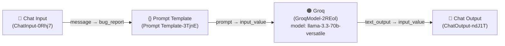

# Bug Triage Agent

A Langflow flow that automatically triages incoming bug reports using an LLM (Groq),
acting as a virtual **Senior QA Lead with 15 years of experience**. It classifies bugs
by severity and category, assesses reproduction confidence, and flags similar known
issue patterns — producing a structured, consistent triage report from raw, free-text
bug descriptions.

- **Flow file:** [`BugTraigeAgent.json`](./BugTraigeAgent.json)
- **Flow name:** `BugTraigeAgent`
- **Flow ID:** `86f3770f-f65f-4032-9ceb-2c3a3f18a882`
- **Langflow version:** `1.10.1`

---

## Diagram



Visual layout (as designed in Langflow):

```
┌───────────┐      ┌──────────────────────┐      ┌────────────────────┐      ┌────────────┐
│ Chat Input│ ───► │   Prompt Template    │ ───► │        Groq        │ ───► │ Chat Output│
│           │      │  (Bug Triage prompt) │      │ llama-3.3-70b-     │      │            │
│           │      │  var: bug_report     │      │ versatile          │      │            │
└───────────┘      └──────────────────────┘      └────────────────────┘      └────────────┘
```

---

## How the flow works

1. **Chat Input** (`ChatInput-0Rhj7`)
   Accepts the raw bug report text from the user (e.g., pasted from a ticket, email,
   or support message). Output: `message` (type `Message`).

2. **Prompt Template** (`Prompt Template-3TjnE`)
   Injects the incoming bug report into the `{bug_report}` variable of a fixed
   Bug Triage prompt (see [Prompt](#prompt) below), instructing the LLM to act as a
   Senior QA Lead and return a structured classification. Output: `prompt` (type `Message`).

3. **Groq** (`GroqModel-2REol`)
   Sends the fully-rendered prompt to the Groq LLM API for inference and generates
   the triage response. Output: `text_output` (type `Message`).

4. **Chat Output** (`ChatOutput-ndJ1T`)
   Displays the model's structured triage response back to the user in the
   Langflow Playground / API response.

### Prompt

```
Bug Traige:

Prompt
You are a Senior QA Lead with 15 years of experience triaging bugs across web, mobile, and API platforms.
CLASSIFICATION RULES:
- CRITICAL: System down, data loss, security breach, payment failures - affects all users
- HIGH: Major feature broken, no workaround, affects >30% of users
- MEDIUM: Feature partially broken, workaround exists, affects <30% of users
- LOW: Cosmetic, typo, minor UX issue, affects <5% of users
CATEGORIES:
- UI/UX: Visual, layout, styling, responsiveness, accessibility -FUNCTIONAL: Business logic, workflow, calculations, validations
- PERFORMANCE: Slow load, timeout, memory leak, high CPU
- SECURITY: Authentication, authorization, data exposure, injection
- DATA: Data loss, corruption, incorrect values, sync issues
- INTEGRATION: API failures, third-party service issues, webhook problems
- INFRASTRUCTURE: Server errors, deployment issues, environment problems

Analyze the follow bug report and provide a STRUCTURED response.

BUG REPORT:
{bug_report}
### Reproduction Confidence
-**Steps Clear:** [Yes / No-what's missing]
-**Environment Specified:** [Yes / No]
-**Frequency:** [Always / Intermittent / Once]

### Similar Known Issues
- [Reference any common patterns you recognize]
```

The `{bug_report}` placeholder is automatically bound to the `bug_report` field, which
receives the `message` output from **Chat Input**.

### Expected output shape

Given the prompt design, the model is expected to return a response containing:

- **Severity:** one of `CRITICAL / HIGH / MEDIUM / LOW`
- **Category:** one of `UI/UX / FUNCTIONAL / PERFORMANCE / SECURITY / DATA / INTEGRATION / INFRASTRUCTURE`
- **Reproduction Confidence** — `Steps Clear`, `Environment Specified`, `Frequency`
- **Similar Known Issues** — patterns the model recognizes from the bug description

> Note: The prompt does not enforce JSON output — the response is free-form structured
> Markdown/text. If downstream systems need machine-parseable output (e.g., strict JSON),
> the prompt should be updated to request a JSON schema explicitly.

---

## Components

| Node | Component Type | Module | Purpose |
|---|---|---|---|
| Chat Input | `ChatInput` | `lfx.components.input_output.chat.ChatInput` | Entry point; captures the bug report text |
| Prompt Template | `PromptComponent` | `lfx.components.models_and_agents.prompt.PromptComponent` | Renders the triage prompt with the `bug_report` variable |
| Groq | `GroqModel` | `lfx.components.groq.groq.GroqModel` | Calls the Groq LLM to generate the triage analysis |
| Chat Output | `ChatOutput` | `lfx.components.input_output.chat_output.ChatOutput` | Returns the model's response to the caller |

### Groq model configuration

| Setting | Value |
|---|---|
| Model | `llama-3.3-70b-versatile` |
| Temperature | `0.1` |
| Max Output Tokens | default (unset → provider default) |
| Streaming | `false` |
| Tool Models Enabled | `false` |
| Base URL | `https://api.groq.com` |
| API Key | Stored as a Langflow **Global Variable** named `GROQKey` (referenced via `api_key.value = "GROQKey"`, `load_from_db: true`) |

---

## Using the Groq API Key

The flow does **not** hardcode a Groq API key. Instead, the `api_key` field references a
Langflow global variable/secret called `GROQKey`. Before running the flow:

1. In Langflow, go to **Settings → Global Variables** (or the key icon on the API Key field).
2. Create/select a variable named `GROQKey` of type **Credential/Secret**.
3. Paste your Groq API key (obtained from [console.groq.com](https://console.groq.com)) as the value.
4. Save — the Groq node will resolve `GROQKey` at runtime via `load_from_db`.

---

## Running the flow

### In the Langflow UI
1. Import `BugTraigeAgent.json` via **Langflow → Import Flow**.
2. Ensure the `GROQKey` global variable is configured (see above).
3. Open the **Playground**, type/paste a bug report into the chat, and submit.
4. The structured triage response streams back in the Chat Output panel.

### Via the Langflow REST API

Langflow exposes every flow as an API endpoint using its flow `id`:

```bash
curl -X POST \
  "http://<LANGFLOW_HOST>:<PORT>/api/v1/run/86f3770f-f65f-4032-9ceb-2c3a3f18a882" \
  -H "Content-Type: application/json" \
  -H "x-api-key: <YOUR_LANGFLOW_API_KEY>" \
  -d '{
        "input_value": "Login button unresponsive on iOS Safari after latest release. Happens every time. Users cannot log in at all.",
        "output_type": "chat",
        "input_type": "chat"
      }'
```

**Request parameters**

| Field | Type | Description |
|---|---|---|
| `input_value` | string | The raw bug report text — flows into Chat Input → `bug_report`. |
| `output_type` | string | `"chat"` to get the Chat Output message. |
| `input_type` | string | `"chat"` to route through Chat Input. |

**Response**

The response contains a `outputs[].outputs[].results.message.data.text` field holding
the LLM's structured triage text (severity, category, reproduction confidence, similar
known issues), plus standard Langflow run metadata (session id, component run trace,
token usage, timings).

> Replace `<LANGFLOW_HOST>:<PORT>` with your Langflow server address, and
> `<YOUR_LANGFLOW_API_KEY>` with a Langflow-issued API key (not the Groq key — that one
> is only used internally by the Groq node).

---

## Notes / Limitations

- Output is unstructured text, not enforced JSON — parse defensively if consuming
  programmatically, or update the prompt to demand strict JSON if integrating with
  automated pipelines (e.g., auto-filing tickets, dashboards).
- `Frequency`, `Environment Specified`, and `Similar Known Issues` quality depend
  entirely on how much detail is present in the submitted bug report.
- Model temperature is low (`0.1`) to keep classifications consistent/deterministic
  across repeated runs of the same bug report.
