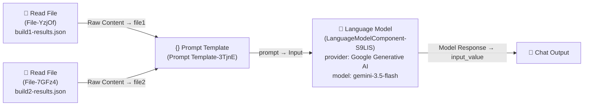

# Flaky Test Analyzer

A Langflow flow that compares two Playwright JSON test reports from the same suite
(**Build 1** vs **Build 2**) and classifies test outcomes into **flaky tests** vs
**consistent (real) failures** — acting as a virtual **senior test reliability
engineer**. This lets QA/engineering quickly decide which failures need a rerun /
quarantine and which need an actual code fix.

- **Flow file:** [`FlakyTestAnalyzer.json`](./FlakyTestAnalyzer.json)
- **Flow name:** `FlakyTestAnalyzer`
- **Flow ID:** `00293637-172a-46d4-832d-1d63d9a71f07`
- **Langflow version:** `1.10.1`
- **Project:** `MyTestProject`

---

## Diagram



Visual layout (as designed in Langflow):

```
┌────────────────────┐
│ Read File (build1) │─┐
└────────────────────┘ │      ┌──────────────────────┐      ┌─────────────────────┐      ┌────────────┐
                        ├────► │   Prompt Template    │ ───► │   Language Model     │ ───► │ Chat Output│
┌────────────────────┐ │      │ file1 / file2 vars   │      │ Google gemini-3.5-   │      │            │
│ Read File (build2) │─┘      │                      │      │ flash                │      │            │
└────────────────────┘        └──────────────────────┘      └─────────────────────┘      └────────────┘
```

---

## How the flow works

1. **Read File — Build 1** (`File-YzjOf`)
   Loads the uploaded `build1-results.json` (Playwright JSON reporter output, ~3.32 KB)
   and outputs its **Raw Content** as a `Message`, feeding the `file1` variable.

2. **Read File — Build 2** (`File-7GFz4`)
   Loads the uploaded `build2-results.json` (Playwright JSON reporter output, ~3.64 KB)
   and outputs its **Raw Content** as a `Message`, feeding the `file2` variable.

3. **Prompt Template** (`Prompt Template-3TjnE`)
   Injects both build reports into a fixed comparison prompt (see [Prompt](#prompt)
   below) with `{file1}` and `{file2}` variables. Output: `prompt` (type `Message`).

4. **Language Model** (`LanguageModelComponent-S9LIS`)
   Sends the fully-rendered prompt to the configured LLM provider for inference.
   Output: `text_output` (type `Message`).

5. **Chat Output** (`ChatOutput-ndJ1T`)
   Displays the model's structured flaky/consistent-failure analysis back to the
   user in the Langflow Playground / API response.

### Prompt

```
You are a senior test reliability engineer. You are given a comparison of two Playwright runs (Build 1 and Build 2) of the same test suite.

COMPARISON REPORT:
{file1} - Build 1 JSON Report
{file2} -Build 2 JSON Report

Definitions you MUST follow:
- FLAKY = non-deterministic result: passed in one build and failed in the other, OR passed only after a retry. Flaky tests need a rerun / quarantine, not a code fix.
- CONSISTENT FAILURE = failed in BOTH builds. A real, reproducible bug, NOT flaky. Needs a fix.

Produce:
1. FLAKY TESTS - names + one-line hypothesis of flake cause (timing, data, parallelism, network...).
2. CONSISTENT FAILURES - tests failing in both builds, each with a probable root cause.
3. RERUN RECOMMENDATION - which to rerun (flaky) vs send to engineering (bugs).
4. SUMMARY - counts + one sentence on suite health.
Base everything only on the comparison data. Do not invent test names.
```

The `{file1}` and `{file2}` placeholders are bound to the `file1`/`file2` fields,
which receive the **Raw Content** `message` output from the two **Read File** nodes.

### Expected output shape

Given the prompt design, the model is expected to return a response containing:

- **1. FLAKY TESTS** — test names + one-line flake-cause hypothesis (timing, data,
  parallelism, network, etc.)
- **2. CONSISTENT FAILURES** — tests failing in both builds, each with a probable
  root cause
- **3. RERUN RECOMMENDATION** — flaky tests to rerun/quarantine vs. failures to send
  to engineering
- **4. SUMMARY** — pass/fail/flaky counts + one sentence on overall suite health

> Note: The prompt does not enforce JSON output — the response is free-form
> structured Markdown/text. The prompt explicitly forbids inventing test names,
> so the model is constrained to only reference names found in the comparison data.

---

## Components

| Node | Component Type | Module | Purpose |
|---|---|---|---|
| Read File (Build 1) | `FileComponent` | `lfx.components.files_and_knowledge.file.FileComponent` | Loads `build1-results.json` and returns its raw content |
| Read File (Build 2) | `FileComponent` | `lfx.components.files_and_knowledge.file.FileComponent` | Loads `build2-results.json` and returns its raw content |
| Prompt Template | `PromptComponent` | `lfx.components.models_and_agents.prompt.PromptComponent` | Renders the comparison prompt with `file1` / `file2` variables |
| Language Model | `LanguageModelComponent` | `lfx.components.models_and_agents.language_model.LanguageModelComponent` | Provider-agnostic LLM call (Anthropic / OpenAI / Google / Ollama / watsonx) that generates the flaky/consistent-failure analysis |
| Chat Output | `ChatOutput` | `lfx.components.input_output.chat_output.ChatOutput` | Returns the model's response to the caller |

### Read File configuration

| Node | Uploaded file | Advanced Parser |
|---|---|---|
| `File-YzjOf` | `build1-results.json` (~3.32 KB) | Off |
| `File-7GFz4` | `build2-results.json` (~3.64 KB) | Off |

Both nodes output the file's **Raw Content** (JSON text) as a `Message`, which the
Prompt Template consumes as plain text inside the prompt — the LLM parses the
Playwright JSON semantically from the prompt text itself.

### Language Model configuration

| Setting | Value |
|---|---|
| Provider | Google Generative AI |
| Model | `gemini-3.5-flash` |
| System Message | `You are a helpful assistant and your task is to do the input received.` |
| Temperature | `0.1` |
| Streaming | `false` |
| Max Tokens | default (unset → provider default) |
| API Key | Overridable per-node; resolves to the global variable `GOOGLE_API_KEY` (`load_from_db: true`) if left blank |

Because this node is Langflow's generic **Language Model** component (not a
provider-specific node), the same flow can be repointed at Anthropic, OpenAI, Ollama,
or IBM watsonx by changing the `model` dropdown — no rewiring required.

---

## Using the Google API Key

The flow does **not** hardcode an API key. The `api_key` field on the Language Model
node is optional and overrides your global provider settings; if left blank it falls
back to the pre-configured global credential (`GOOGLE_API_KEY`). Before running the flow:

1. In Langflow, go to **Settings → Global Variables**.
2. Create/select a variable named `GOOGLE_API_KEY` of type **Credential/Secret**.
3. Paste your Google AI Studio / Gemini API key as the value.
4. Save — the Language Model node will resolve it automatically, or you can supply
   a key directly in the node's (advanced) **API Key** field to override it.

---

## Running the flow

### In the Langflow UI
1. Import `FlakyTestAnalyzer.json` via **Langflow → Import Flow**.
2. Ensure the `GOOGLE_API_KEY` global variable is configured (see above), or set an
   override key on the Language Model node.
3. Upload the two Playwright JSON reports to the **Read File** nodes (Build 1, Build 2).
4. Open the **Playground** and run the flow — the flaky/consistent-failure analysis
   streams back in the Chat Output panel.

### Via the Langflow REST API

Langflow exposes every flow as an API endpoint using its flow `id`.

**PowerShell**

```powershell
$jsonData = @'
{"output_type":"chat","input_type":"text","input_value":"hello world!","session_id":"YOUR_SESSION_ID_HERE"}
'@

curl.exe --request POST `
     --url "http://localhost:7860/api/v1/run/00293637-172a-46d4-832d-1d63d9a71f07?stream=false" `
     --header "Content-Type: application/json" `
     --header "x-api-key: YOUR_API_KEY_HERE" `
     --data $jsonData
```

**curl (bash equivalent)**

```bash
curl --request POST \
  --url "http://localhost:7860/api/v1/run/00293637-172a-46d4-832d-1d63d9a71f07?stream=false" \
  --header "Content-Type: application/json" \
  --header "x-api-key: YOUR_API_KEY_HERE" \
  --data '{
    "output_type": "chat",
    "input_type": "text",
    "input_value": "hello world!",
    "session_id": "YOUR_SESSION_ID_HERE"
  }'
```

**Request parameters**

| Field | Type | Description |
|---|---|---|
| `input_value` | string | Freeform text input. In this flow, both build reports are supplied through the **Read File** nodes' uploaded files, not through `input_value` — `input_value` is only consumed if you route chat input directly (this flow's primary data path is the two file uploads → Prompt Template). |
| `output_type` | string | `"chat"` to get the Chat Output message. |
| `input_type` | string | `"text"` or `"chat"` depending on how you want to trigger the run. |
| `session_id` | string | Optional session identifier for conversation/history tracking. |
| `stream` (query param) | boolean | `false` for a single synchronous JSON response; omit or set `true` to stream. |
| `x-api-key` | header | Your Langflow-issued API key (not the Google/Gemini key — that's only used internally by the Language Model node). |

**Response**

The response contains an `outputs[].outputs[].results.message.data.text` field
holding the LLM's structured analysis (flaky tests, consistent failures, rerun
recommendation, summary), plus standard Langflow run metadata (session id, component
run trace, token usage, timings).

> Replace `localhost:7860` with your Langflow server address, and
> `YOUR_API_KEY_HERE` / `YOUR_SESSION_ID_HERE` with your actual Langflow API key and
> desired session id.

---

## Notes / Limitations

- Output is unstructured text, not enforced JSON — parse defensively if consuming
  programmatically, or update the prompt to demand strict JSON if integrating with
  automated pipelines (e.g., auto-quarantining tests, dashboards, CI gating).
- Both Playwright JSON reports must be from **the same test suite** for the
  flaky-vs-consistent comparison logic to be meaningful — the prompt does not
  attempt to reconcile mismatched suites.
- The prompt instructs the model not to invent test names, but accuracy still
  depends on the size/format of the uploaded Playwright JSON reports fitting within
  the model's context window.
- Model temperature is low (`0.1`) to keep classifications consistent/deterministic
  across repeated runs of the same comparison data.
