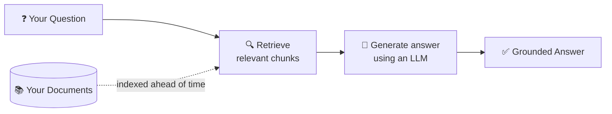
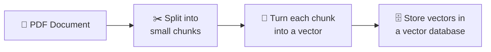
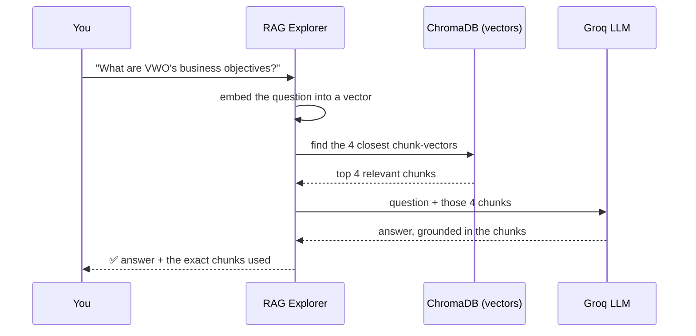
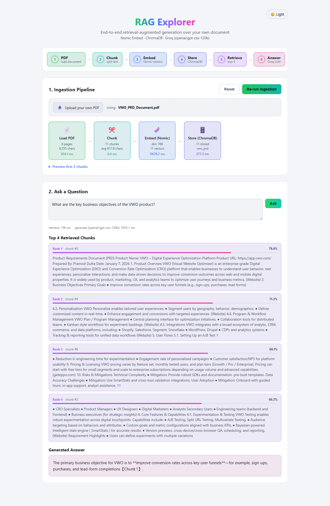

# RAG Explorer

A hands-on demo app that shows exactly what happens, step by step, when you
ask an LLM a question about a document — using the **VWO Product
Requirements Document** as the example.

---

## What is RAG, in simple terms?

**RAG = Retrieval-Augmented Generation.**

LLMs like GPT or Llama are smart, but they only know what they were trained
on — they've never seen *your* PDF, your company wiki, or today's news.
RAG is a trick to give an LLM "open-book exam" access to your own
documents, without retraining the model at all.

Think of it like this:

> You ask a librarian a question. Instead of answering from memory, the
> librarian **first finds the 4 most relevant pages** in the library, hands
> them to an expert, and says *"answer the question using only these
> pages."* The expert (the LLM) then writes a grounded answer, citing what
> it read.

That's RAG in one sentence: **retrieve relevant text, then generate an
answer from it.**



Without RAG, an LLM either **guesses** or says *"I don't know."* With RAG,
it answers using facts pulled straight from your own source material —
which is why the answers can **cite exactly which chunk they came from**.

---

## The two phases of RAG

RAG always happens in two separate phases. This app lets you watch both of
them happen live.

### Phase 1 — Ingestion (done once, ahead of time)



1. **Load** — read the raw text out of the PDF.
2. **Chunk** — cut the text into small, overlapping pieces (~800
   characters each). Small pieces retrieve more precisely than whole pages.
3. **Embed** — convert each chunk into a list of numbers (a *vector*) that
   captures its meaning. Chunks about similar topics end up as similar
   vectors.
4. **Store** — save all those vectors in a vector database for fast
   similarity search later.

### Phase 2 — Query (happens every time you ask a question)



The key idea: **the LLM never sees the whole PDF.** It only ever sees the
4 chunks that were retrieved for that specific question — which keeps
answers fast, cheap, and grounded in real text instead of guesswork.

---

## The tools used to build this

| Stage | Tool | Why |
|---|---|---|
| Frontend UI | **React + Vite** | Fast dev server, component-based UI to visualize each pipeline stage live |
| Backend API | **FastAPI** (Python) | Simple, async-friendly REST API connecting the UI to the RAG pipeline |
| PDF parsing | **pypdf** | Extracts raw text from the PDF page by page |
| Chunking | **LangChain Text Splitters** (`RecursiveCharacterTextSplitter`) | Splits text into overlapping ~800-character chunks along natural breakpoints (paragraphs → sentences → words) |
| Embeddings | **Nomic Embed** (`nomic-embed-text-v1.5`, via `sentence-transformers`) | Converts text into 768-dimension vectors — runs **locally**, no API key needed |
| Vector storage & search | **ChromaDB** | Local, persistent vector database; finds the closest chunks to a question using cosine similarity |
| Answer generation | **Groq** running `openai/gpt-oss-120b` | Ultra-fast LLM inference API that writes the final answer from the retrieved chunks |

### Why these specific choices?

- **Nomic Embed runs locally** — no API key, no per-chunk cost, and it
  works offline once the model is downloaded (~500MB, one time).
- **ChromaDB** needs zero setup — it's just a folder on disk
  (`backend/chroma_store/`), making it perfect for a demo.
- **Groq** is used only for the final answer-writing step, and it's known
  for being one of the fastest LLM inference providers available — answers
  come back in ~1 second.

---

## How this maps to the UI

Open the app and you'll see the pipeline laid out exactly as described
above, including a 6-step overview stepper (PDF → Chunk → Embed → Store →
Retrieve → Answer) that lights up, stage by stage, as each phase runs:

**Section 1 — Ingestion Pipeline**
Upload your own PDF, or leave it blank to use the bundled VWO PRD as the
default. Four cards (`Load PDF → Chunk → Embed (Nomic) → Store (ChromaDB)`)
light up with real stats — page count, chunk count, embedding dimensions,
and how many milliseconds each stage took.

**Section 2 — Ask a Question**
Type a question → see the **top 4 retrieved chunks** (with similarity
percentages) → see the **final answer** generated by Groq, citing which
chunk(s) it used.

Here's the whole pipeline running end to end — ingestion stats on top,
retrieved chunks with similarity scores, and the grounded answer at the
bottom:



---

## Running it yourself

```bash
# 1. Backend (Python 3.12 recommended)
cd backend
pip install -r requirements.txt
# add your GROQ_API_KEY to backend/.env (copy .env.example)
python -m uvicorn main:app --reload --port 8000

# 2. Frontend
cd frontend
npm install
npm run dev
```

Then open the frontend URL, click **Run Ingestion** once, and start asking
questions about the VWO PRD.
